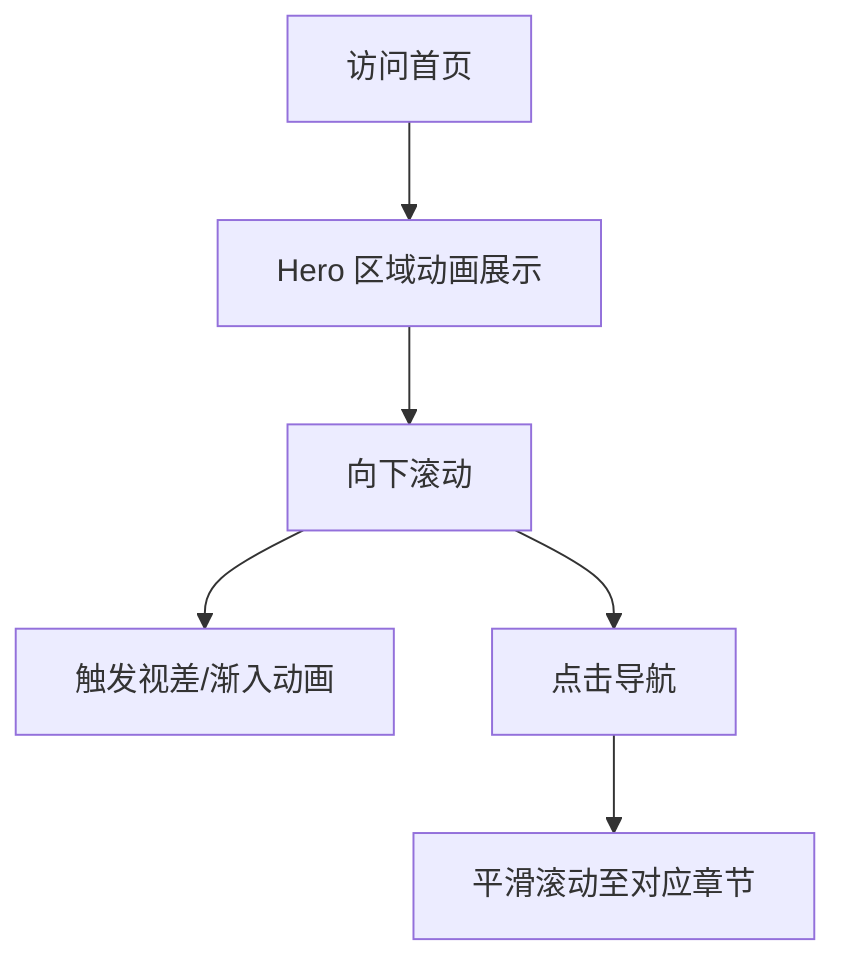
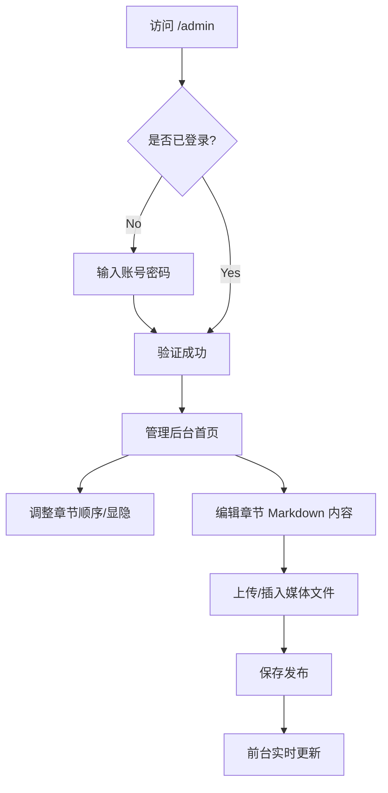

# 产品需求文档 (PRD)

## 1. 产品概述

打造一个具有 Apple 官网级视觉体验的个人自我介绍网站。该网站旨在通过极致的简约美学、流畅的视差滚动动画和沉浸式交互，展示个人的职业经历、项目作品与技能专长。
核心价值在于结合高端的前端展示与灵活的后台管理（CMS），让用户既能享受顶级的浏览体验，又能通过 Markdown 和可视化配置轻松管理网站内容。

## 2. 核心功能

### 2.1 用户角色

| 角色           | 注册/登录方式        | 核心权限                                |
| ------------ | -------------- | ----------------------------------- |
| 访客 (Visitor) | 无需登录           | 浏览前台页面，查看个人介绍、项目及媒体内容               |
| 管理员 (Admin)  | 邮箱/密码登录 (预设账号) | 访问管理后台，配置目录结构，编辑 Markdown 内容，上传媒体资源 |

### 2.2 功能模块

本网站包含以下核心页面：

1. **前台首页 (Home Page)**：全屏展示，包含视差滚动、动态章节（关于我、项目、技能等）。
2. **管理员登录页 (Admin Login)**：管理员身份验证入口。
3. **管理后台 (Admin Dashboard)**：内容管理系统，支持章节排序、显隐控制、内容编辑。

### 2.3 页面详情

| 页面名称       | 模块名称    | 功能描述                                                        |
| ---------- | ------- | ----------------------------------------------------------- |
| **前台首页**   | Hero 区域 | 全屏展示个人形象/Slogan，配合淡入淡出及视差滚动动画。                              |
|       | 动态章节展示  | 根据后台配置渲染多个内容区块（如“关于我”、“项目经历”）。支持 Markdown 渲染（标题、列表、链接、代码块）。 |
|       | 富媒体展示   | 在内容中自适应展示图片、视频（YouTube/本地视频），支持懒加载与流媒体播放。                   |
|       | 导航/目录   | 悬浮或侧边导航，支持点击平滑滚动至对应章节。                                      |
| **管理员登录页** | 身份认证    | 输入邮箱和密码进行登录，验证失败提示错误信息。                                     |
| **管理后台**   | 目录配置    | 列表展示所有章节，支持拖拽排序、修改章节标题、切换显示/隐藏状态。                           |
|       | 内容编辑器   | 集成 Markdown 编辑器（如 MDXEditor），支持实时预览。支持插入图片/视频链接。            |
|       | 媒体管理    | 上传图片或视频文件到云存储，并生成链接插入编辑器。                                   |
|       | 个人信息设置  | 修改全局配置（如网站标题、SEO 关键词、Hero 区域文案）。                            |

## 3. 核心流程

### 访客浏览流程

### 管理员管理流程

## 4. 用户界面设计

### 4.1 设计风格

* **风格参考**：Apple 官网 (iPhone 17 Pro 页面)，追求极致的简约、现代感与科技感。

* **配色方案**：

  * 主色调：深色模式为主（#000000, #1d1d1f），搭配高级灰。

  * 强调色：使用低饱和度的金属色或高亮白（#f5f5f7）作为文字和关键元素。

* **排版**：

  * 字体：使用 San Francisco (Mac) 或 Inter (Windows) 等无衬线字体。

  * 字号：大标题排版，正文留白充足，行高舒适（1.5-1.6）。

* **交互动画**：

  * **视差滚动 (Parallax)**：背景与前景元素以不同速度移动。

  * **滚动触发 (Scroll-triggered)**：元素进入视口时淡入、上浮或放大。

  * **平滑过渡**：页面切换或模态框使用弹簧物理动画 (Spring Physics)。

### 4.2 页面设计概览

| 页面名称     | 模块名称 | UI 元素                                                          |
| -------- | ---- | -------------------------------------------------------------- |
| **前台首页** | 整体布局 | 单页应用 (Single Page)，流式布局。背景可使用动态模糊色块或高质量深色图片。                   |
|     | 导航栏  | 顶部半透明磨砂玻璃效果 (Backdrop blur)，滚动时吸顶。                             |
|     | 内容卡片 | 大圆角 (Rounded-3xl)，微弱边框 (1px border with low opacity)，无阴影或深沉阴影。 |
| **管理后台** | 布局   | 侧边栏导航 + 右侧内容区。风格保持简洁，注重操作效率，使用卡片式表单。                           |

### 4.3 响应式设计

* **策略**：Desktop-First（优先设计桌面端体验），向下兼容移动端。

* **适配**：

  * 桌面端：多列布局，宽屏视觉冲击力。

  * 移动端：单列流式布局，汉堡菜单导航，优化触摸滑动体验。确保视频和图片自适应宽度。

