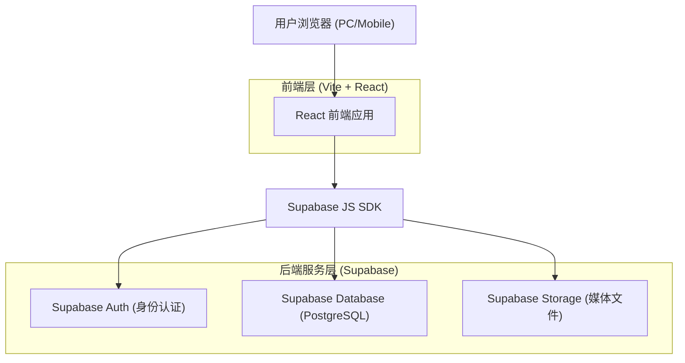
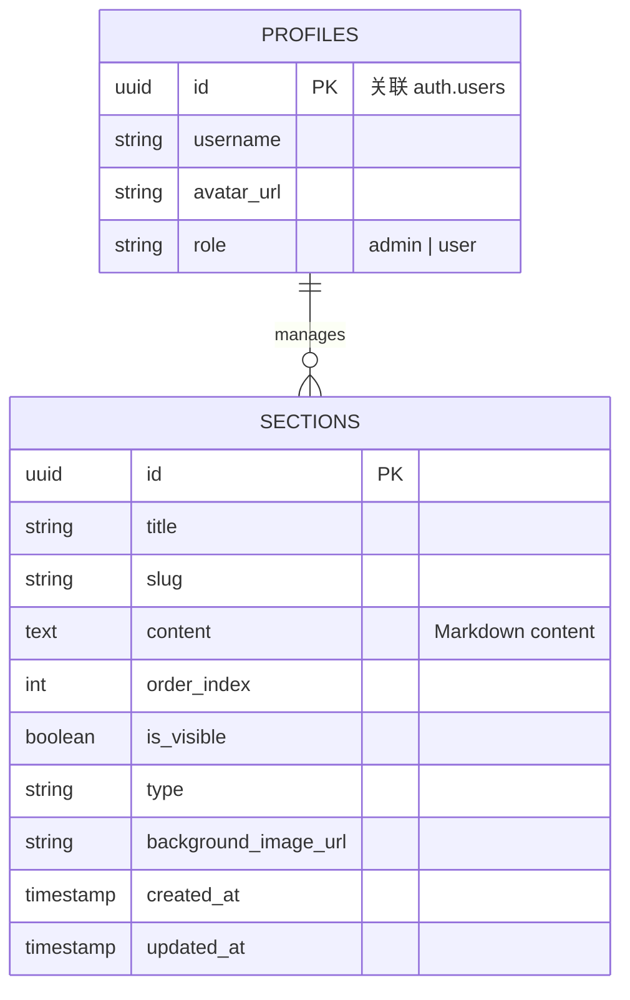

# 技术架构文档

## 1. 架构设计

本系统采用现代化的 **前后端分离 (SPA)** 架构，结合 **Serverless** 后端服务。前端负责极致的交互体验与渲染，后端基于 Supabase 提供数据存储、文件存储与身份认证服务。



## 2. 技术栈描述

### 前端 (Frontend)
*   **核心框架**: React @18
*   **构建工具**: Vite (提供极速的开发与构建体验)
*   **样式方案**: TailwindCSS @3 (原子化 CSS，快速实现响应式布局)
*   **动画库**: Framer Motion (核心库，用于实现 Apple 风格的视差滚动、布局过渡与手势交互)
*   **路由管理**: React Router DOM @6
*   **Markdown 渲染**: react-markdown + rehype-highlight (支持富文本与代码高亮)
*   **图标库**: Lucide React (现代化、风格统一的图标)
*   **状态管理**: Zustand (轻量级状态管理，用于管理章节配置与用户会话)

### 后端与基础设施 (Backend & Infra)
*   **BaaS 平台**: Supabase (替代传统的 Node.js/Python 后端，降低维护成本，提供开箱即用的 Auth 和 DB)
*   **数据库**: PostgreSQL (Supabase 内置)
*   **对象存储**: Supabase Storage (用于存储图片、视频等富媒体资源)
*   **部署**: Vercel 或 Netlify (推荐前端托管平台，支持 CI/CD)

## 3. 路由定义

| 路由 | 目的 |
|------|------|
| `/` | **前台首页**。加载所有配置为“可见”的章节，展示视差滚动效果。 |
| `/login` | **管理员登录页**。处理管理员身份验证。 |
| `/admin` | **管理后台概览**。需要 Auth 守卫。展示章节列表，提供排序入口。 |
| `/admin/edit/:id` | **章节编辑页**。编辑特定章节的 Markdown 内容与元数据。 |
| `/admin/settings` | **全局设置页**。配置网站标题、SEO 信息等。 |

## 4. API 定义 (基于 Supabase SDK)

系统不使用传统的 REST API 接口，而是直接通过 Supabase Client SDK 与数据库交互。以下为核心数据操作的 TypeScript 类型定义示例。

### 核心类型定义 (Shared Types)

```typescript
// 章节类型定义
export interface Section {
  id: string; // UUID
  title: string;
  slug: string; // 用于锚点链接
  content: string; // Markdown 字符串
  type: 'hero' | 'text' | 'projects' | 'contact'; // 模块类型
  order_index: number; // 排序索引
  is_visible: boolean; // 是否可见
  background_image_url?: string; // 背景图 (用于视差)
  created_at: string;
  updated_at: string;
}

// 媒体文件类型
export interface MediaFile {
  id: string;
  url: string;
  name: string;
  size: number;
  type: string;
}
```

## 5. 数据模型 (Data Model)

### 5.1 数据模型定义



### 5.2 数据定义语言 (DDL)

```sql
-- 开启 UUID 扩展
create extension if not exists "uuid-ossp";

-- 1. 创建 Sections 表 (存储网站章节内容)
create table sections (
  id uuid primary key default uuid_generate_v4(),
  title text not null,
  slug text not null unique,
  content text default '',
  order_index integer default 0,
  is_visible boolean default true,
  type text default 'text',
  background_image_url text,
  created_at timestamp with time zone default timezone('utc'::text, now()),
  updated_at timestamp with time zone default timezone('utc'::text, now())
);

-- 2. 设置行级安全策略 (RLS)
alter table sections enable row level security;

-- 允许任何人读取可见的章节
create policy "Public sections are viewable by everyone"
  on sections for select
  using ( true );

-- 仅允许认证用户(管理员)进行增删改
create policy "Admins can insert sections"
  on sections for insert
  to authenticated
  with check ( true );

create policy "Admins can update sections"
  on sections for update
  to authenticated
  using ( true );

create policy "Admins can delete sections"
  on sections for delete
  to authenticated
  using ( true );

-- 3. 创建 Storage Bucket
-- (需在 Supabase Dashboard 手动创建名为 'portfolio-media' 的公开 Bucket)
```
